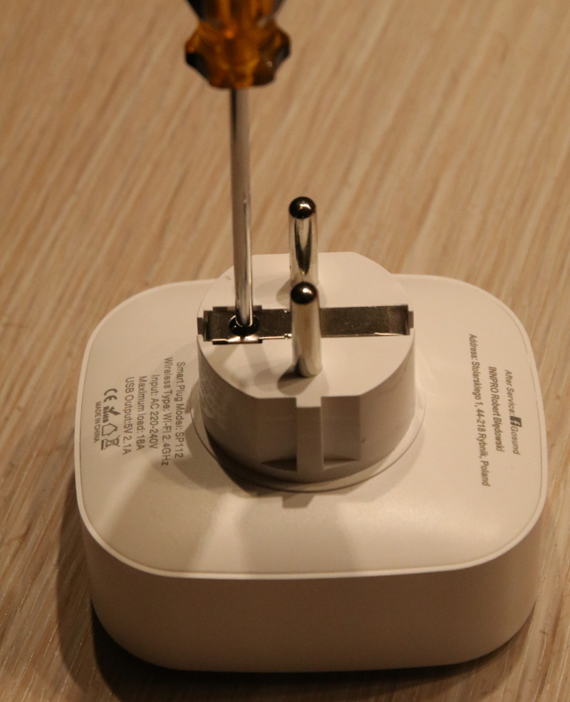
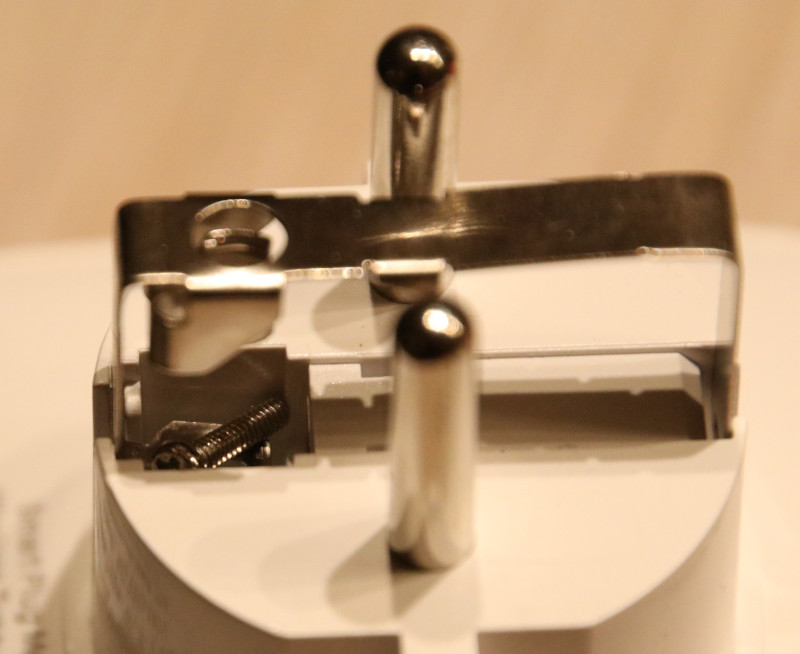
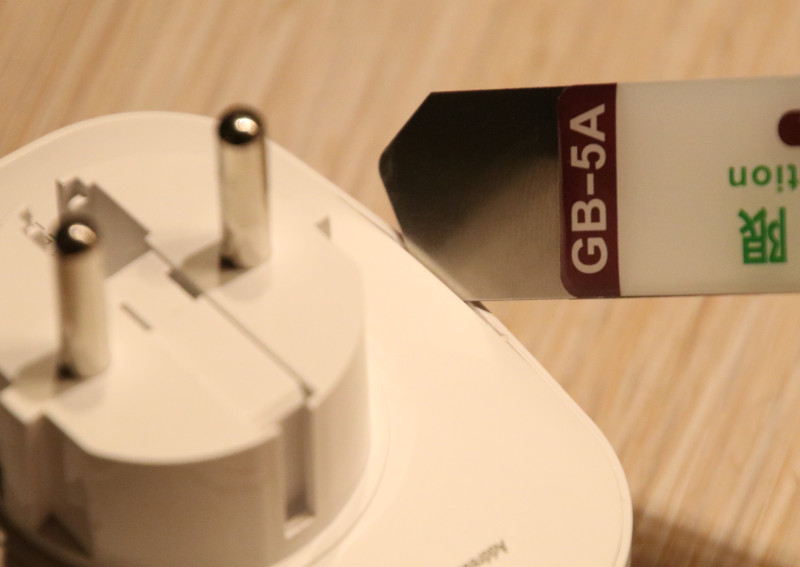
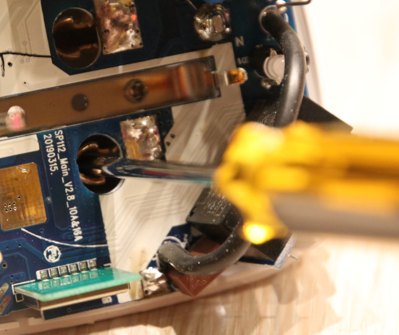
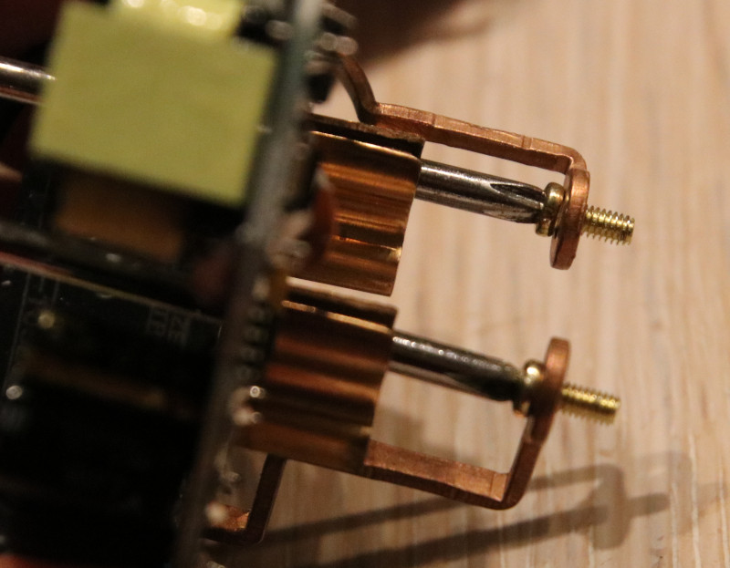

# Power-Monitor Gosund SP112

Diese Schaltsteckdose mit eingebauter Stromüberwachung gibt es im 4er-Pack für 33€ bei Amazon. Sie hat einen ESP8266 zur Steuerung und kann den 230V Ausgang sowie zwei USB-Ports schalten.

Als Software kommt Tasmota zum Einsatz. Die Installation ist recht gut dokumentiert:

* https://blog.moneybag.de/wlan-steckdose-mit-2-usb-anschluessen-und-tasmota-von-gosund-sp-112/
* https://github.com/arendst/Tasmota/issues/5756
* https://templates.blakadder.com/blitzwolf_SHP5.html

## Flashen

Das Gerät lässt sich wie in den verlinkten Artikeln beschrieben auseinanderbauen. Zum Aufhebeln setze ich ein "opening-tools" vom letzten Handy-Displaywechsel ein, das ist ein flaches Metallstück, welches man in die Spalten schieben kann.

> Zuerst wird die Schraube unten gelöst

> Um die Schraube später wieder an diese Stelle zu bekommen, muss man das Metallteil unten abziehen

> Am Spalt wird das Gerät vorsichtig geöffnet (Es ist an den Ecken eingerastet)

> Diese zwei Schrauben halten die Platine am Gehäuseboden

> Beim Zusammenbau kann man die Schrauben mit zwei Schraubendrehern in Position halten.

Die Firmware tasmota-DE.bin habe ich bereits von https://github.com/arendst/Tasmota/releases heruntergeladen.

Löten ist für das Flashen nicht notwendig. 5V und GND versorge ich direkt über USB (ich verwende ein altes, abgeschnittenes USB-Kabel). Beim Booten muss IO0 an GND gelegt werden, um im Flash-Modus zu starten. Nun kann esptool.py gestartet werden (erstmal zum Sichern der Firmware, dann zum Flashen), wenn "Connection" da steht, kann RX/TX an die entsprechenden PINs gehalten werden (über Kreuz, RX an TX, TX an RX).

Nach dem Flashen muss das Gerät neu gestartet werden. Bevor man es zusammenbaut, sollte man prüfen, dass es per WLAN (tasmota-XXXX) erreichbar ist.

Der Zusammenbau ist etwas trickreich: man muss die beiden Schrauben wieder in die Löcher bekommen, sie neigen dazu, herauszufallen, dann muss man die Platine nochmal rausziehen und die Schrauben neu positionieren. Am Besten geht es, wenn man zwei Schraubendreher in den Schrauben stecken lässt, während man die Platine einführt.

Beim Aufsetzen des Deckels muss darauf geachtet werden, dass der Taster korrekt sitzt. Sonst kann es passieren, dass man den Plastikstift davon abbricht.

## Tasmota Setup

* [Tasmota Basissetup](Tasmota-Basissetup.md)
* Vorlagen:
    * Taster schaltet Steckdose: `{"NAME":"Gosund SP112","GPIO":[57,145,56,146,0,22,0,0,0,0,21,0,17],"FLAG":0,"BASE":18}`
    * Taster schaltet USB: `{"NAME":"Gosund SP112","GPIO":[57,145,56,146,0,22,0,0,0,0,21,0,18],"FLAG":0,"BASE":18}`
* Gerätename: steckdose-XXXX

### Kalibrieren

* Gerät zusammen mit einem kalibrierten PowerMeter und einer ohmschen Last (z.B. Glühlampe, min. 60 Watt) anschließen
* Ich verwende hier unsere Wasserbett-Heizung, die liefert sehr stabile Werte und liegt bei ~200 Watt
* Konsole
* Spannung setzen mit `VoltageSet <Spanung in Volt>`
* Strom setzen mit `CurrentSet <Strom in mA>`
* Leistung setzen mit `PowerSet <Leitung in Watt>`
* Werte prüfen
