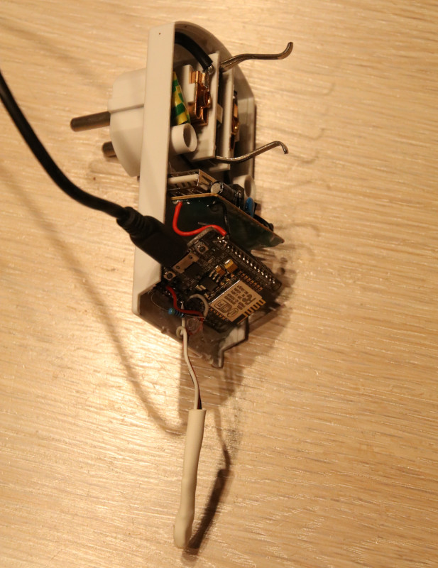
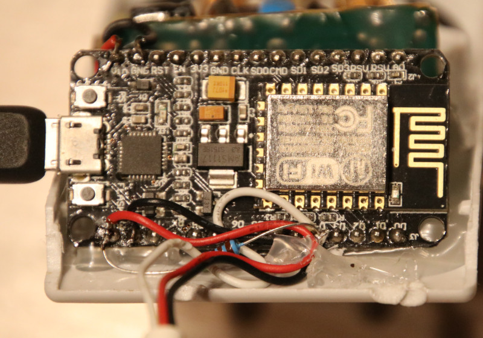

# Thermometer im Eigenbau

Überall in der Wohnung und auf dem Grundstück habe ich Thermometer verteilt, welche aus einem ESP8266 und einem Temperatursensor (meist DS18x20, manchmal DHT22/AM2302) bestehen.

## Geräte

### DS18x20 in altem Dimmer-Gehäuse


> In einem alten Dimmer-Gehäuse finden ein Netzteil (ehemaliges USB-Steckernetzteil) und ein NodeMCU-Board Platz. Die Steckdose ist durchgeleitet und kann weiter genutzt werden.


> Anschlüsse des Sensors

* Sensor GND an GND
* Sensor VCC an 3.3V
* Sensor DATA an D4 (GPIO02)
* optionaler Pullup: 4k7 Ohm zwischen 3.3V und D4

## Tasmota Setup

* Flashen direkt auf den ESP8266
* [Tasmota Basissetup](Tasmota-Basissetup.md)

* Gerätename: sensor-XXXX
* Vorlagen:
    * DS18x20 an D4 (GPIO02):  `{"NAME":"Sensor","GPIO":[0,0,4,0,0,0,0,0,0,0,0,0,0],"FLAG":0,"BASE":18}`
    * DHT22 an D4 (GPIO02):  `{"NAME":"Sensor","GPIO":[0,0,2,0,0,0,0,0,0,0,0,0,0],"FLAG":0,"BASE":18}`
* Wenn kein Pullup verbaut ist, muss "SetOption74 1" an der Konsole ausgeführt werden (https://github.com/arendst/Tasmota/wiki/Commands#SetOption74)
* Konsole
    * Alle 30s Werte senden: TelePeriod 30

## Einbindung in Homeassistant

### Sensor-Status

```yaml
binary_sensor:
  - name: Temperatur Küche
    platform: mqtt
    state_topic: sensor-123/tele/LWT
    payload_on: Online
    payload_off: Offline
```

### Temperaturanzeige DS18x20

```yaml
sensor:
  - name: Temperatur Küche
    platform: mqtt
    state_topic: "sensor-1234/tele/SENSOR"
    value_template: '{{ value_json["DS18B20"]["Temperature"] }}'
    unit_of_measurement: "°C"
    expire_after: 1800
```

### Temperatur/Luftfeuchte DHT22

```yaml
sensor:
  - name: Temperatur Küche
    platform: mqtt
    state_topic: "sensor-1234/tele/SENSOR"
    value_template: '{{ value_json["AM2301"]["Temperature"] }}'
    unit_of_measurement: "°C"
    expire_after: 1800
  - name: Luftfeuchtigkeit Küche
    platform: mqtt
    state_topic: "sensor-1234/tele/SENSOR"
    value_template: '{{ value_json["AM2301"]["Humidity"] }}'
    unit_of_measurement: "%"
    expire_after: 1800

```
